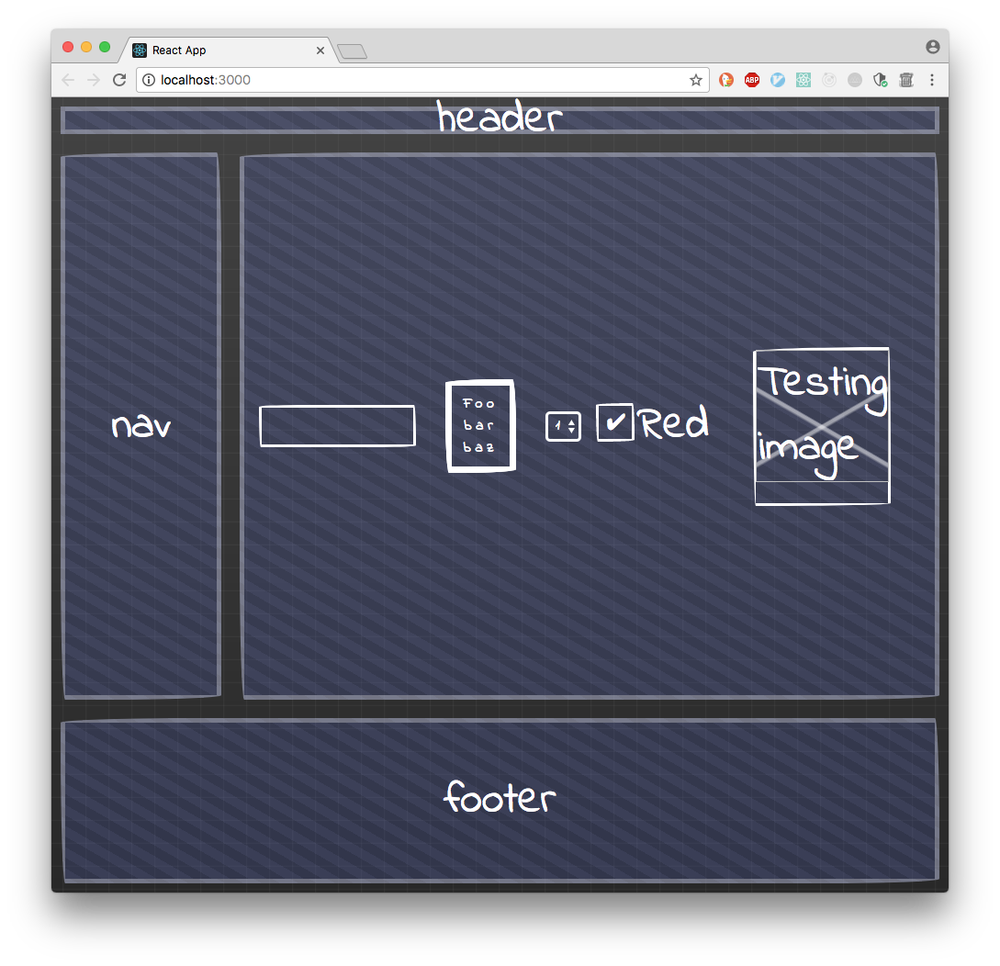

# Quickframe

> Don't make the Demo look Done
> -- Kathy Sierra

Quickframe is a set of CSS styles to help make throw away wireframes
directly in HTML.

It aims to be as low ceremony as possible, with most of the styling
being provided by matching simple HTML tags.

Fonts are provided by Google Fonts CDN.  There is one file and no other dependencies.


## Tags and Classes
The main classes provided by quickframe are .grid and .wire.

```HTML
  <article class="grid Layout">
    <header class="wire Layout__header">header</header>
    <nav class="wire Layout__nav">nav</nav>
    <section class="wire Layout__section">
      <button>Do Something</button>
      <select>
        <option>1</option>
        <option>2</option>
        <option>3</option>
      </select>

      <input type="checkbox" id="test1" />
      <label htmlFor="test1">Red</label>
      
    </section>
    <footer class="wire Layout__footer">footer</footer>
  </article>
```




## Install

Simply copy the index.css to your local web server and link to the
stylesheet from HTML.

Alternatively install as dev dependency using npm.

*Currently this is work in progress and not yet published to npm.*

Until it's published it can be tested by cloning the repo and using npm
link locally:-

```sh
git clone git@github.com:seandunn/quickframe.git

cd quickframe; npm link

cd /path/to/your/test/project; npm link quickframe
```

and link to HTML using your preferred method.

e.g. If using webpack for CSS ala create-react-app


```jsx
  import 'quickframe/index.css';
```
